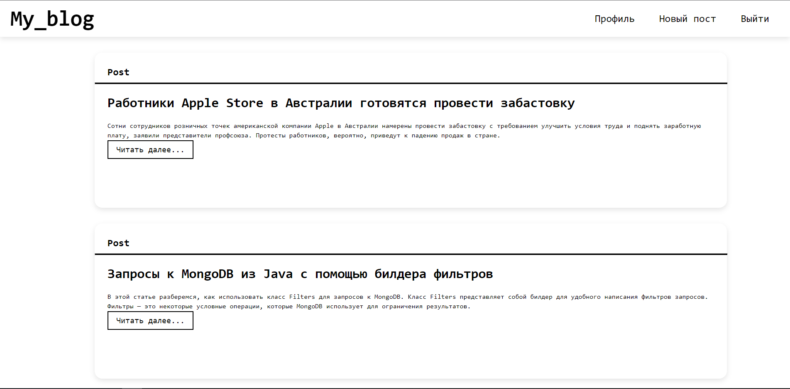

# My_blog

## My blog - веб-приложение сделанное на Flask c возможностью создать свой блог а также читать блоги  других пользователей. 

---
## Функции:
1. вхою/регистрация
2. добавление/удаление постов
3. CRUD
4. PEP8

---
## Языки и инструменты использованные в данном проекте:

---
## Установка
 
### Python

Установите Python версии 3.6 и выше.

### Зависмости

Установите зависимости из файла requirements.txt 

Команда для windows `pip install -r requirements.txt`

Команда для linux или macOS `pip3 install -r requirements.txt`

### Запуск

Для запуска программы используйте файл `run.py`

Команда для windows `python run.py`

Команда linux или macOS `python3 run.py`
